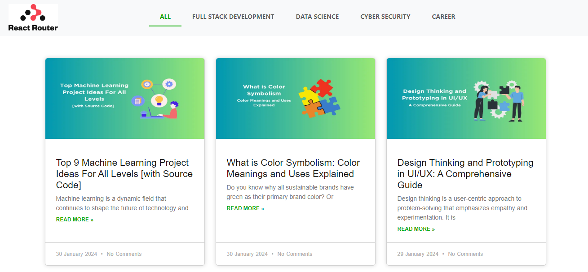

# React Router Blog Application




This project demonstrates a web page with routes using react-router-dom, designed to replicate the navigation and content structure of the [Guvi blog page](https://www.guvi.in/blog/). It features category-based navigation and static content for each category.

## Features
- **Category Navigation:** Includes All, Full Stack Development, Data Science, Cyber Security, and Career.
- **Static Content:** Displays static content for each category based on the selected route.
- **Responsive Design:** Adapts to various screen sizes for a seamless user experience.
- **Navigation Bar:** Uses `NavLink` for active route styling.
- **Single Page Application:** Ensures smooth transitions without page reloads.

## Technologies Used
- **React:** Library for building user interfaces.
- **React Router DOM:** Routing library for React.
- **HTML/CSS:** Markup and styling.
- **JavaScript:** Programming language for building the app.

## How to Start
1. **Clone the Repository:**
   ```bash
   git clone https://github.com/Rajkumar-195/React-Router-Blog-Application
2. **Navigate to the project directory:**
   ```bash
   cd React-Router-Blog-Application

3. **cd react-shopping-cart:**
   ```bash
   npm install

4. **Start the development server:**
   ```bash
   npm run dev

## Development Process

- **Setup:** Initialize a React project and install React Router DOM.
- **Routing:** Create routes for each category (All, Full Stack Development, Data Science, Cyber Security, Career).
- **Navigation:** Implement a navigation bar using NavLink for routing between categories.
- **Content Components:** Develop components for each category with static content.
- **Styling:** Apply CSS to mimic the design of the Guvi blog page.
- **Testing:** Ensure that navigation and content rendering work correctly.
- **Deployment:** Deploy the app to a hosting service for live access.

## Conclusion

This project highlights the use of React Router DOM to create a navigable single-page application. It showcases the ability to replicate existing web designs with efficient routing and static content rendering.

## Contact

For any inquiries or feedback, please contact:
- Name: Rajkumar A
- Email: rajkumaranbu195@gmail.com
- LinkedIn: [Rajkumar A](https://www.linkedin.com/in/rajkumar-info/)
